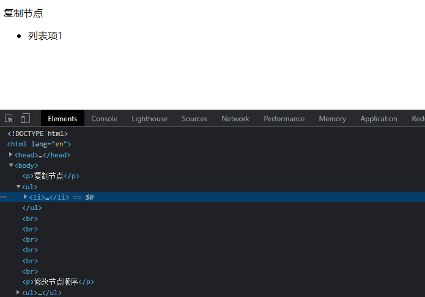
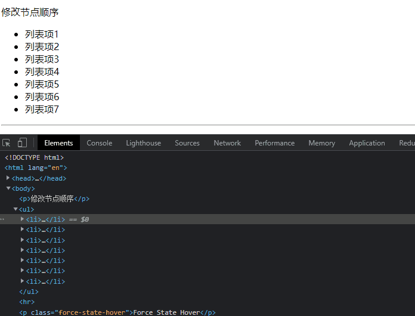
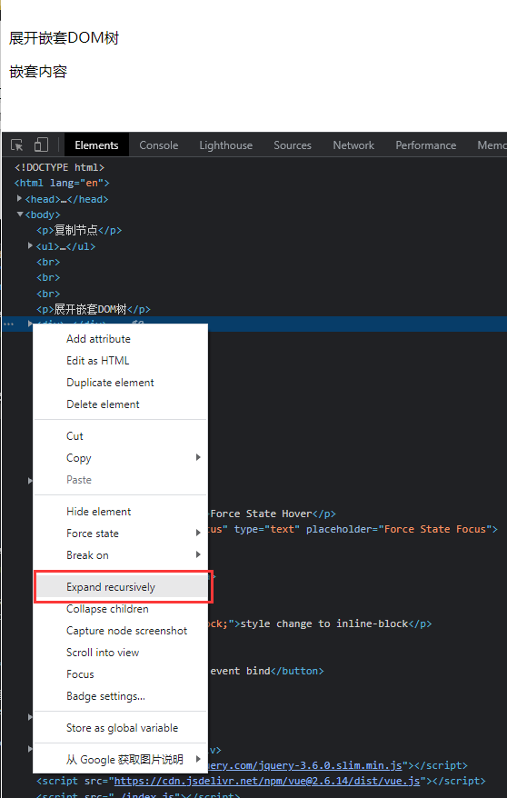
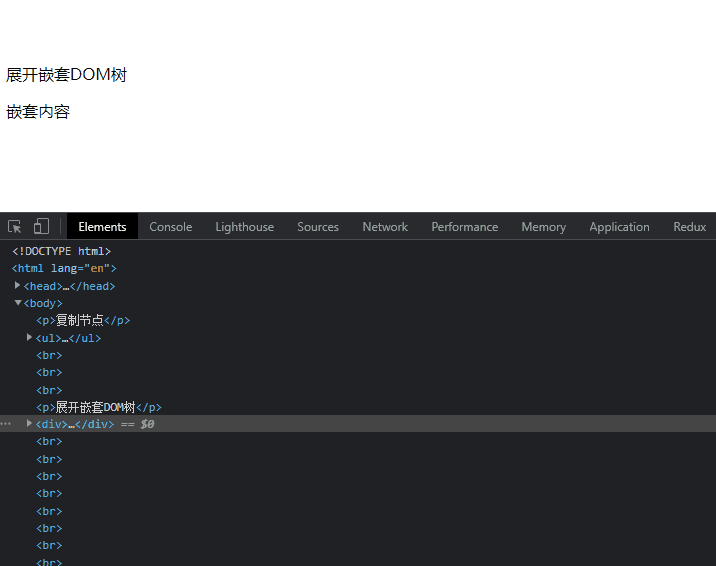
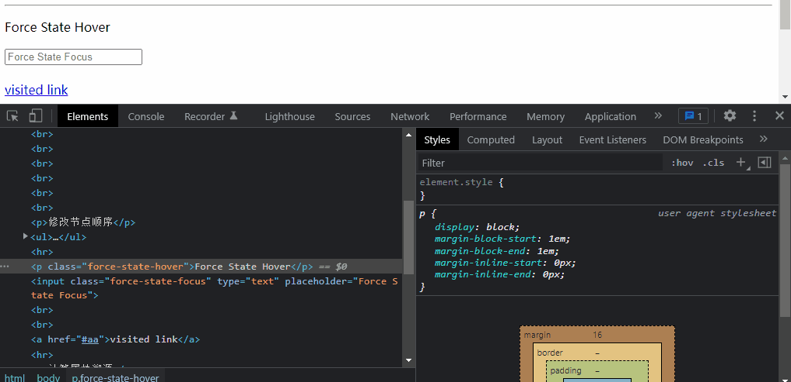
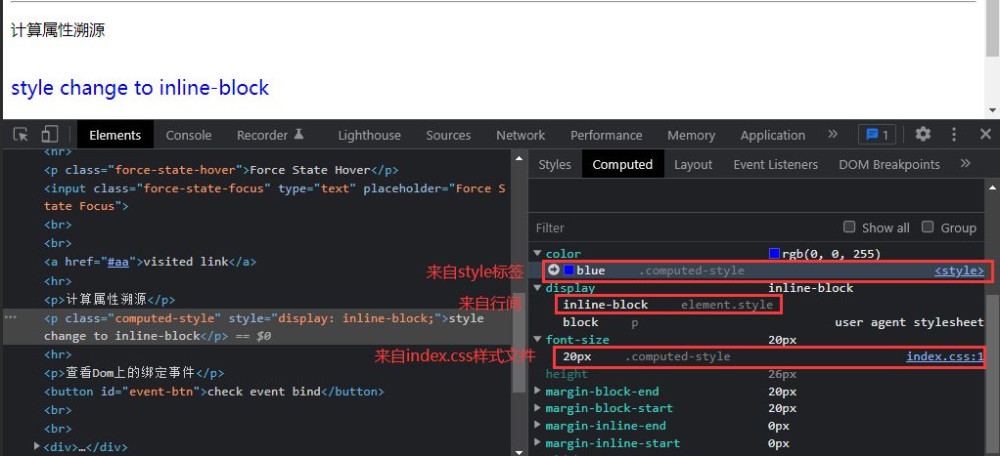
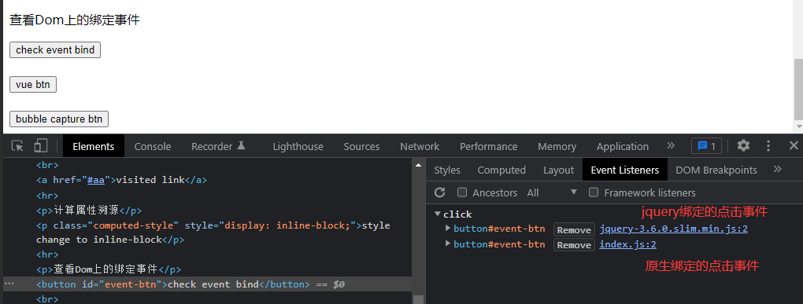
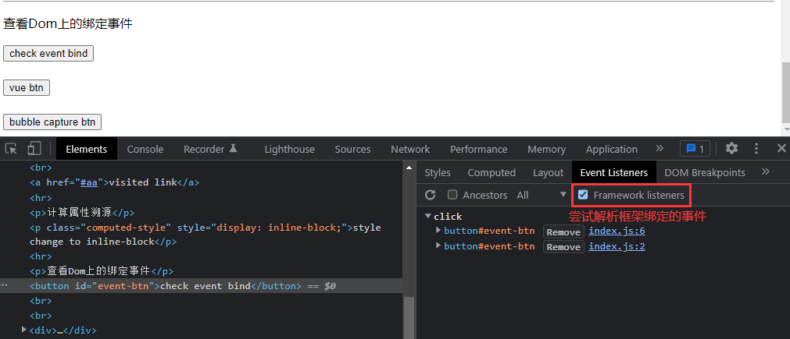

Element面板是我们在平时开发中最常见的一个面板

主要作用很直观的体现就是"检查元素"、"检视样式"，但其实Element面板还有很多好用的功能

####1、快速复制节点
* 选中要复制的节点 ctrl + c (Mac Command + c)
* 选中要粘贴的父节点 ctrl + v (Mac Command + v)

####2、重新排序节点
鼠标拖动节点到想移动的位置

####3、快速展开多层嵌套DOM树
* 鼠标操作：选中父节点，右键选择 Expand recursively

* 键盘快捷键 Alt + 鼠标点击箭头

####4、锁定元素state

* Styles选项卡中点击 :hov

####5、计算属性溯源

* 通过computed选项卡可以看到元素样式是从哪个位置来的
(user agen stylesheet 代表浏览器自带样式)

####6、查看DOM上绑定的事件

* 通过Event Listeners选项卡可以看到元素上绑定的事件
* 右侧会显示绑定事件所在的代码位置，点击可以定向到具体代码

* Framework listeners 尝试解析由框架绑定的事件
* 可以看到勾选了Framework listeners之后，上一张图显示的jquery绑定的事件已经定位到我们源码位置
(vue、react等框架绑定的事件无法通过这个选项直接看到绑定位置)

