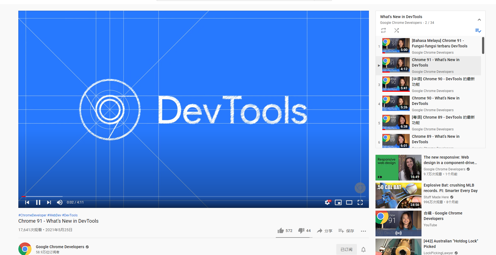

(PS: 懒癌式随缘更新中)
不专业、不全面的科普介绍Chrome Devtools

分享一些自己在平时开发时对Chrome Devtools的一些使用技巧

往下看之前，在浏览器上按下F12或Ctrl+Shift+I (Mac Command+Shift+I) 
或鼠标右键菜单点击"检查"打开Devtools
#### 目录
- [ ] [Element面板](/Element/index.md)
- [ ] Console面板
- [ ] Sources面板
- [ ] Performance面板
- [ ] Debug Remote Device调试远程设备

---

写在最后

1、 Chrome Devtools文档：https://developer.chrome.com/docs/devtools/overview/

2、Chrome Developer YouTube 频道（Chrome每次更新都会出一个介绍视频，有时有中文）https://www.youtube.com/channel/UCnUYZLuoy1rq1aVMwx4aTzw

3、Chrome的每次更新也会放出Devtools的Change Logs，有新功能都可以实时关注
